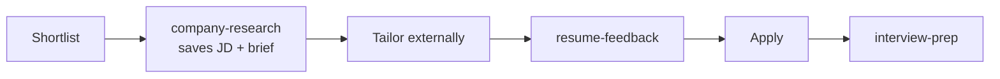

<p align="center">
  
</p>

# Iago

**Iago is your job search assistant.** It's eager to help, full of opinions, and occasionally a little too sure of itself. Use it to surface roles, triage your pipeline, and prep for interviews, but treat its output as a starting point: check listings are still live, read the briefs, and sanity-check anything that sounds too good before you hit apply.

A Cursor-native workflow for sourcing PM/PO/BA roles and tracking applications. No app to deploy: open the repo in Cursor, configure local search criteria, and run a daily agent-driven search that updates YAML trackers and writes a daily report.

## Getting Started

```bash
git clone git@github.com:lachlanmag/iago.git
cd iago
bash scripts/init-data.sh
```

1. Edit `data/config.yaml`:
   - Set `profile.resume_path` to your local master resume (markdown, outside this repo)
   - Set `profile.location`, role priorities, and search source URLs for your market
   - Optional: `profile.output_language` for research, prep, and feedback artifacts
2. Open the repo folder in Cursor
3. In chat: **Run the daily job search**

### Prerequisites

- [Cursor](https://cursor.com) with Agent
- Network access for job board search
- For headless runs: `cursor agent login` (once)

## How It Works

1. **Search for roles** with the daily search workflow.
2. **Track what you find** in local YAML files under `data/`.
3. **Review and prioritize** your pipeline when enough roles pile up.
4. **Shortlist and research** promising jobs, saving the JD and a brief automatically.
5. **Review your tailored resume** before applying.
6. **Generate interview prep** once an application is submitted.

### What Iago handles

- Daily job search and deduplication
- Listing freshness checks
- Fit scoring and prioritization
- Application pipeline tracking
- Company research on shortlist
- Resume feedback before apply
- Interview prep on submit

### What Iago does not handle

- Resume tailoring or rewriting
- Cover letter generation
- PDF export
- Final judgment on whether a role is worth applying to

## Core Workflows

### Daily search

**In Cursor chat:**

> Run the daily job search

Trigger phrases: daily job search, job hunt, find new jobs, `/iago`, `/iago-daily`.

**Headless (Cursor Agent CLI):**

```bash
bash scripts/run-daily-search.sh
```

Logs: `data/logs/latest.log`

Override run timezone: `IAGO_TZ=Australia/Sydney bash scripts/run-daily-search.sh`

### Pipeline review

After daily searches build up `discovered` roles, triage and prioritize without running a new search:

> Review my pipeline and tell me what to prioritize

Writes a report to `data/pipeline-reviews/YYYY-MM-DD.md` with ranked apply targets, shortlist promotions, and listing verification. Trigger phrases: pipeline review, prioritize applications, `/iago-pipeline`, `/pipeline-review`.

### Application workflow

Typical path from shortlist to interview prep:



Point `profile.resume_path` at your master resume for fit scoring during search. Shortlisting via `update-application` or pipeline review saves the full JD to `data/jds/` and sets `jd_path` on the tracker row automatically.

If you initialized `data/` before v1.1, re-run `bash scripts/init-data.sh` to create `jds/`, `company-research/`, `interview-prep/`, and `resume-feedback/` (safe to re-run; existing config files are not overwritten).

### Status updates

Use `update-application` so status changes chain follow-on work automatically:

| Action | Command example | Chained skill |
|--------|-----------------|---------------|
| Shortlist | `Shortlist [Company]` | `company-research` (saves JD + role brief) |
| Apply | `Set [Company] to applied on [date]` | `interview-prep` (talking points) |

Pipeline review also runs `company-research` when you confirm a `discovered` -> `shortlisted` promotion.

Status values: `discovered`, `shortlisted`, `applied`, `interview`, `rejected`, `withdrawn`, `offer`, `closed`.

Trigger phrases: shortlist [Company], set [Company] to applied, update my tracker, `/iago-update`, `/update-application`.

### Company research

Produces a role brief under `data/company-research/`, saves the full JD under `data/jds/`, and sets `company_research` and `jd_path` on the tracker row.

> Research [Company] for this role

Trigger phrases: company brief, role brief, `/iago-brief`, `/company-research`. Runs automatically when you shortlist via `update-application` or pipeline review.

### Resume feedback

Reviews a tailored resume artifact against the job description. It does not rewrite the resume. Artifacts save to `data/resume-feedback/`.

> Review my tailored resume for [Company]

Provide the saved JD path (`jd_path` on the tracker row, or user path) and your tailored resume artifact. Trigger phrases: resume feedback, ATS review, `/iago-feedback`, `/resume-feedback`.

### Interview prep

Produces talking points under `data/interview-prep/` and sets `interview_prep` on the tracker row.

> Interview prep for [Company]

Trigger phrases: talking points, `/iago-interview`, `/interview-prep`. Runs automatically when you set status to `applied` via `update-application`.

## Repository Layout

```
iago/
  .cursor/skills/
    iago-daily/                    # Daily search; /iago, /iago-daily
    iago-pipeline-review/          # Pipeline triage; /iago-pipeline
    update-application/            # Tracker updates; /iago-update
    company-research/              # Role brief; /iago-brief
    interview-prep/                # Talking points; /iago-interview
    resume-feedback/               # Resume review; /iago-feedback
  assets/                            # Logo and favicon
  examples/                          # Templates to copy into data/
  data/                              # Your local state (gitignored)
  scripts/                           # init-data.sh, run-daily-search.sh
  favicon.ico                        # Browser favicon (16/32/48)
  favicon.png                        # Favicon PNG (32×32)
  docs/ROADMAP.md                    # Future work and gaps
```

### Local data

Following the same pattern as [Resume-Matcher](https://github.com/srbhr/Resume-Matcher) (`apps/backend/data/`): personal files live in a gitignored directory inside the repo.

| File | Purpose |
|------|---------|
| `config.yaml` | Search criteria, sources, fit rubric |
| `applications.yaml` | Application pipeline tracker |
| `seen-jobs.yaml` | Dedup index |
| `recruiters.yaml` | Recruiter outreach (optional) |
| `daily-runs/YYYY-MM-DD.md` | Daily search reports |
| `pipeline-reviews/YYYY-MM-DD.md` | Pipeline triage and prioritization reports |
| `company-research/` | Role briefs (auto when shortlisted) |
| `jds/` | Full job descriptions (auto when shortlisted) |
| `interview-prep/` | Interview prep (auto when applied) |
| `resume-feedback/` | Tailored resume review artifacts |
| `logs/` | CLI run logs |

Nothing under `data/` is committed. Run `git status` after a daily search or pipeline review to confirm.

## Automation

### Scheduled daily search on macOS

```bash
chmod +x scripts/*.sh
# Replace __REPO_ROOT__ in scripts/com.example.iago-daily.plist with your clone path
cp scripts/com.example.iago-daily.plist ~/Library/LaunchAgents/
launchctl load ~/Library/LaunchAgents/com.example.iago-daily.plist
```

If you previously scheduled the old `com.example.job-search-daily` agent, unload and remove it first:

```bash
launchctl unload ~/Library/LaunchAgents/com.example.job-search-daily.plist
rm ~/Library/LaunchAgents/com.example.job-search-daily.plist
```

This is optional. You can also just run the search manually from Cursor chat.

## Post-merge checklist (repo rename)

Clone and issue links in this repo assume the GitHub repo is named `iago`. After merging the Iago rebrand:

1. Rename the GitHub repo to `iago` on github.com
2. `git remote set-url origin git@github.com:lachlanmag/iago.git`
3. Optionally rename your local clone directory to `iago`
4. If launchd is loaded: `launchctl unload ~/Library/LaunchAgents/com.example.job-search-daily.plist`
5. Remove `~/Library/LaunchAgents/com.example.job-search-daily.plist`
6. Set `__REPO_ROOT__` in `scripts/com.example.iago-daily.plist`
7. `cp scripts/com.example.iago-daily.plist ~/Library/LaunchAgents/`
8. `launchctl load ~/Library/LaunchAgents/com.example.iago-daily.plist`
9. Re-open the repo in Cursor from the new folder path

## Roadmap

See [docs/ROADMAP.md](docs/ROADMAP.md) for planned skills, Obsidian compatibility, regional presets, and other expansion ideas.

## License

MIT. See [LICENSE](LICENSE).
